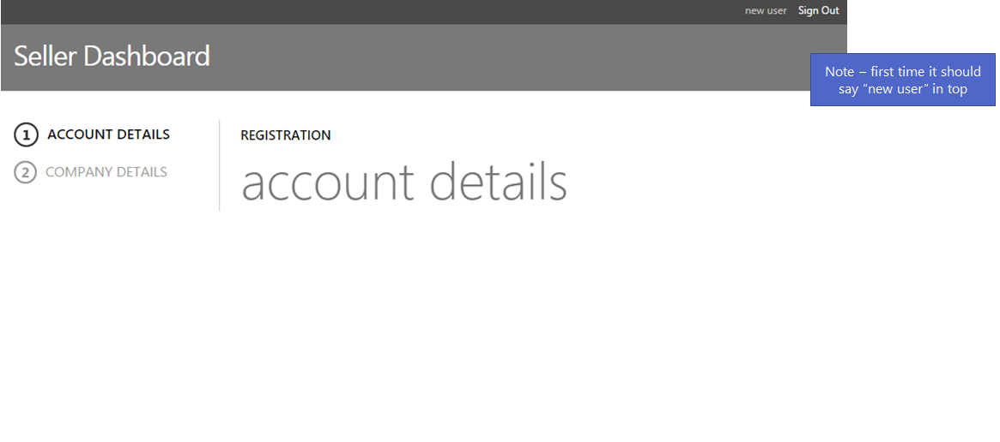

##Maken image

###Correcte basis VHD
De OS VHD voor de VM moet gebaseerd zijn op een Microsoft Azure gebaseerde image die **Windows Server**, **SQL server** of **Linux** bevat. 
Ga naar (https://portal.azure.com/) en start een VM met **Windows Server 2012 R2** image. 

 
  
###RDP naar de VM
We hebben twee bestanden die op de VM geplaatst moeten worden.  


  

######Initiate.ps1:  
  
``` powershell  

#download script
$source = "https://aspexscomtest.blob.core.windows.net/scom-gw/Client_Side.PS1"
$destination = (get-item .).fullname + "\Client_Side.PS1"
Invoke-WebRequest $source -OutFile $destination
#start script
.\Client_Side.PS1
```  
  
######SetupComplete.cmd:  
  
``` powershell  

powershell -command "& {Set-ExecutionPolicy Unrestricted}"
powershell %windir%\Setup\Scripts\initiate.PS1
powershell -command "& {Set-ExecutionPolicy RemoteSigned}"
```  
  
pad op vm waar bestanden moeten geplaatst worden: **C:\Windows\Setup\Scripts**. Om bestanden op de VM te krijgen deel ik mijn E: schiijf met de VM. Dit kan doormiddel van de RDP file aan te passen.  
//image  
Dan kopieer ik de bestanden naar de script file op de VM.  

###Azure powershell installeren
De Microsoft web installer kan niet worden geïnstalleerd op de VM dus zet ik de install file op de E: schijf die ik al gedeeld heb en installeer ik de Azure powershell via daar. (http://www.microsoft.com/web/downloads/platform.aspx)  
  
###Aanmaken user VM image
Aan de hand van een script dat van uw disk  een user image wordt gemaakt.  
  
**Zien dat alles buiten de OS VHD file verwijderd wordt, de disk mag niet meer gelinkt zijn aan de vm en resourcegroup en elk e resource binnen de groep. Certificaat moet nog toegevoegd worden aan account voor starten script! (certificate.ps1)**  
  
######Certificate.ps1
  

``` powershell
[xml]$pubFile = Get-Content "E:\TEMP\User Image script\Cloud SCOM Test - client side-10-9-2015-credentials.publishsettings"
[byte[]]$certData = [System.Convert]::FromBase64String($pubfile.PublishData.PublishProfile.ManagementCertificate)
$cert = [System.Security.Cryptography.X509Certificates.X509Certificate2] $certData
$store = Get-Item cert:\LocalMachine\My\
$store.Open([System.Security.Cryptography.X509Certificates.OpenFlags]"ReadWrite")
$store.add($cert)
$store.Close()
```
  
  
**Dan het certificaat toevoegen aan je Azure account:**  
``` powershell
Set-AzureSubscription -subscriptionname "Cloud SCOM Test - client side" -certificate  "\\pad\naar\*.cer"
```
  
  
######Userimage.ps1
``` powershell
# Image Parameters to Specify 
$ImageName=’SComgatewayimage’ 
$Label='test monitoring' 
$Description='Monitoring your VMs with SCOM Gateway’ 
$osCaching='ReadWrite' 
$os = 'Windows' 
$state = 'Generalized' 
$osMediaLink = 'https://aspexscomtest.blob.core.windows.net/vhds/TestImageMarket-TestImageMarket-os-1444313823424.vhd' 
$dataCaching='None' 
$lun='1' 

# Subscription Related Properties 
$SrvMngtEndPoint='https://management.core.windows.net' 
$subscription = Get-AzureSubscription -Current -ExtendedDetails 
$certificate = $subscription.Certificate 
$SubId = $subscription.SubscriptionId 
$body =  
"<VMImage xmlns=`"http://schemas.microsoft.com/windowsazure`" xmlns:i=`"http://www.w3.org/2001/XMLSchema-instance`">" + 
"<Name>" + $ImageName + "</Name>" +
"<Label>" + $Label + "</Label>" + 
"<Description>" + $Description + "</Description>" + "<OSDiskConfiguration>" + 
"<HostCaching>" + $osCaching + "</HostCaching>" + 
"<OSState>" + $state + "</OSState>" + 
"<OS>" + $os + "</OS>" + 
"<MediaLink>" + $osMediaLink + "</MediaLink>" + 
"</OSDiskConfiguration>" + 
"</VMImage>" 
$uri = $SrvMngtEndPoint + "/" + $SubId + "/" + "services/vmimages" 
$headers = @{"x-ms-version"="2015-04-01"} 
$response = Invoke-WebRequest -Uri $uri -ContentType "application/xml" -Body $body -Certificate $certificate -Headers $headers -Method POST 
if ($response.StatusCode -ge 200 -and $response.StatusCode -lt 300) 
{ 
echo "Accepted" 
} else { 
echo "Not Accepted" } 
$opId = $response.Headers.'x-ms-request-id' 
$uri2 = $SrvMngtEndPoint + "/" + $SubId + "/" + "operations" + "/" + $opId 
$response2 = Invoke-WebRequest -Uri $uri2 -ContentType "application/xml" -Certificate $certificate -Headers $headers -Method GET 
$response2.RawContent

```
  
//image
  
Om te controleren of de user image wel degelijk is aangemaakt moet je nog een script lopen omdat er enkel een 202 respons is.  
  
``` powershell
$opId = "8ee10c5d-e5cc-202d-8d16-c1426f1ee6bf"
$uri2 = $SrvMngtEndPoint + "/" + $SubId + "/" + "operations" + "/" + "$opId" 
$response2 = Invoke-WebRequest -Uri $uri2 -ContentType "application/xml" -Certificate $certificate -Headers $headers -Method GET 
$response2 | fl *

```
  
**$opid veranderen naar laatste oprations status**
  
###Maak VM met user Image

Ga naar **New > Compute > VM > From Gallery**  
//image

###Certificatie van VM
Dit is nodig omdat je niet zomaar images op de Market place kan plaatsten. Daarom moet deze eerst door een reeks testen.  
#####Download Microsoft certification tool  
(http://go.microsoft.com/fwlink/?LinkID=526913)  

#####Start certification tool
//image  

Username en paswoord zijn de credentials van de VM.  
De testresultaten worden als zip opgeslagen. Deze moet je in de publish site meegeven als je de image certifieerd.

  
###SASurl van base VHD
SAS staat voor Shared Access Token. De SASurl is nodig om restricted access te geven aan de Azure storage waarop de VHD file staat. 

Storage Account toevoegen waarop de VHD staat. **Gebruik de base VHD en niet de VHD van de certified VM**.  

//images  
//images
  
**Probleem**: de start dag voor permitted access een dag voor de huidige want anders bestaat er een kans dat door een verschil in tijdszone geen toegang kan gekregen worden.  

##Certificiëring van image in publish site
(https://publish.windowsazure.com/workspace/virtual-machines)  
[Nieuwe VM aanmaken](//image)  
[Geef je een SKU op in de aangemaakte VM offer](//image) 
  
Je kan bij VM image, ook recommended VM size meegeven. Deze worden voorgesteld aan de user maar hij kan nog altijd tussen alle sizes kiezen. Voor deze VM moeten de poorten 5723 (SCOM gateway) en 443 (HTTPS) opengezet worden. Bij **OS VHD URL** moet je de SASurl die we gegenereerd hebben invullen. De zip van testresultaten moet je hier ook uploaden.

[Daarna druk je op **Request certification**](//image)
  
**Problemen**: had SASurl van de gecertificiërde VM gebruikt inplaats van de base VHD file.
